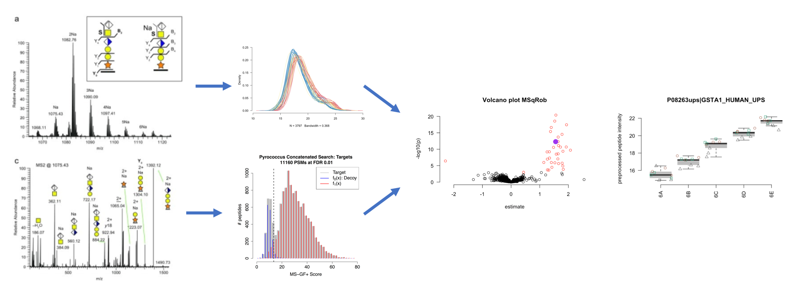

### Course Description
High throughput 'omics studies generate ever larger datasets and, as a consequence, complex data interpretation challenges. This course focuses on the statistical concepts involved in preprocessing, quantification and differential analysis of high throughput omics data. Moreover, more advanced experimental designs and blocking will also be introduced. The core focus will be on shotgun proteomics and next generation sequencing. The course will rely exclusively on free and userfriendly opensource tools in R/Bioconductor. The course will provide a solid basis for beginners, but will also bring new perspectives to those already familiar with standard data analysis workflows for proteomics and next-generation sequencing applications.

### Target Audience
This course is oriented towards biologists and bioinformaticians with a particular interest in differential analysis for quantitative 'omics.

### Prerequisites
The prerequisites for the Statistical Genomics course are the successful completion of a basic course of statistics that covers topics on data exploration and descriptive statistics, statistical modeling, and inference: linear models, confidence intervals, t-tests, F-tests, anova, chi-squared test.

The basis concepts may be revisited in my online course [https://gtpb.github.io/PSLS20/](https://gtpb.github.io/PSLS20/) and in [https://statomics.github.io/statistiekCursusNotas/](https://gtpb.github.io/PSLS20/)

A primer to R and Data visualisation  in R can be found in:

- R Basics: [https://dodona.ugent.be/nl/courses/335/](https://dodona.ugent.be/nl/courses/335/)
- R Data Exploration: [https://dodona.ugent.be/nl/courses/345/](https://dodona.ugent.be/nl/courses/345/)

---

#### Topics

**Introduction**

  - Slides: [Intro](assets/intro.pdf)
  - Software: [Install and Launch Statistical Software](pages/software4stats.md)
  - Recap linear models: [case study](assets/recapGeneralLinearModel.html)
  - Entire analysis for KPNA2 gene: [KPNA2](assets/08-multipleRegression_KPNA2.html)

**Part I: Quantitative proteomics**

  - [Download Tutorial Data](https://github.com/statOmics/SGA2019/tree/data)

  1. Bioinformatics for proteomics
  - Slides: [Bioinformatics for Proteomics](assets/martens_proteomics_bioinformatics_20190923.pdf)
  - Students can sharpen their background knowledge on Mass Spectrometry, Proteomics & Bioinformatics for Proteomics
 here:[Mass Spectrometry and Bioinformatics for Proteomics](pages/techVideos.md)

 2. Identification
 - Slides:  [False Discovery Rate and Target Decoy Approach](assets/1_Identification_Evaluation_Target_Decoy_Approach.pdf)
 - Tutorial: [Evaluating Target Decoy Quality](pages/Identification.md), [example script identification](assets/identification.html),
 [All searches](assets/identification_all.html)

 3. Preprocessing & Analysis of Label Free Quantitative Proteomics Experiments with Simple Designs
 - Install Software: [Installation instructions msqrob2](pages/installMsqrob2.md)
 - Slides: [Preprocessing](assets/2_MSqRob_data_analysisI.pdf)
 - Tutorial: [preprocessing](pages/sdaMsqrobSimple.md)

 4. Statistical Inference & Analysis of Experiments with Factorial Designs
 - Slides: [Inference](assets/2_MSqRob_data_analysisII.pdf)
 - Tutorial: [Statistical Data Analysis with MSqRob for Factorial Designs](pages/sdaMsqrobDesign.md)

 5. Reading Material and Technical details
    - Paper: [Sticker et al. (2020) Robust summarization and inference in proteome-wide label-free quantification](https://www.biorxiv.org/content/10.1101/668863v1)
    - part of PhD dissertation: [Extensive Background on proteomics and proteomics data analysis](assets/backgroundProteomicsDataAnalysis.pdf)
    - [Inference upon summarization](assets/technicalDetailsProteomics.html)

6. Stagewise testing: Omnibus test and post hoc analysis: [slides](assets/stagewiseTesting.pdf)

7. Solutions
  - [cptac median](assets/cptac_median.html)
  - [cptac robust](assets/cptac.html)
  - [cptac maxLFQ](assets/cptac_maxLfQ.html)
  - [cancer 3 vs 3](assets/cancer2_3x3.html)
  - [cancer 6 vs 6](assets/cancer2_6x6.html)
  - [cancer 9 vs 9](assets/cancer2_9x9.html)
  - [mouse CRD](assets/mouseCRD2.html)
  - [mouse RCB](assets/mouseRCB2.html)
  - [mouse RCB wrong analysis](assets/mouseRCBwrongAnalysis.html)
  - [heart](assets/heartMainInteraction.html)

---

##### [Instructors](pages/instructors.md)
