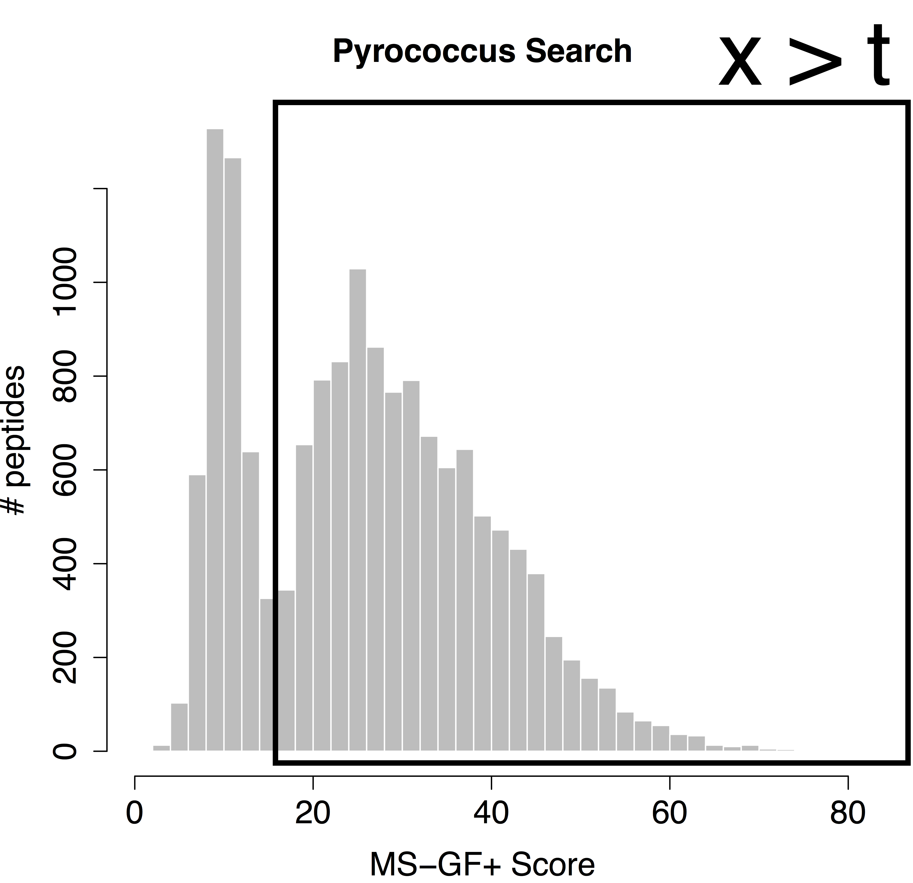

<script src="https://cdnjs.cloudflare.com/ajax/libs/mathjax/2.7.0/MathJax.js?config=TeX-AMS-MML_HTMLorMML" type="text/javascript"></script>


### 1. Identification: Evaluation of Target Decoy Approach

Shotgun proteomics relies on the assignment of a large number of spectra to theoretical peptides derived from a sequence database. Multiple search engines have been developed for this task, each with its own advantages and drawbacks. Most proteomics database searches are performed as so-called target/decoy searches. A crucial assumption of the target/decoy approach is that the decoy PSM hits have similar properties as bad target hits so that the decoys can be used to characterize the distribution of bad hits. In this tutorial we will introduce diagnostic plots that can be used to evaluate these assumptions.

#### 1.1 Basic Statistical Concepts

We first introduce some notation. With x we denote the PSM score and we assume that larger score values indicate a better match to the theoretical spectrum. Then the scores will follow a mixture distribution:

$$ f(x)=\pi_0 f_0 (x)+(1-\pi_0 ) f_1 (x), $$

with \\( f(x) \\) the target PSM score distribution, \\( f_0(x) \\) the mixture component corresponding to incorrect PSMs, \\( f_1(x) \\)  the mixture component corresponding to the correct PSMs and \\( \pi_0 \\) the fraction of incorrect PSMs.
Based on the mixture distribution we can calculate the posterior probability that a PSM with score x is a bad match:

$$ P[\text{Bad hit} \vert \text{score }x]=\frac{\pi_0 f_0 (x)}{f(x)}, $$

which is also referred to as the posterior error probability (PEP) in mass spectrometry based proteomics.
Based on the mixture model, we can also calculate the posterior probability that a random PSM in the set of all PSMs with scores above a score threshold t is a bad hit (see e.g. Figure 1):

$$ P[\text{Bad hit} \vert \text{score }x>t]=\pi_0 \frac{\int\limits_{x=t}^{+\infty} f_0(x)dx}{\int\limits_{x=t}^{+\infty} f(x)dx}, $$

with \\(\int\limits_{x=t}^{+\infty} f_0(x)dx \\) the probability to observe a bad PSM hit above the threshold and,  \\(\int\limits_{x=t}^{+\infty} f_0(x)dx \\)  the probability to observe a target PSM hit above the threshold. The probability \\( P[\text{Bad hit} \vert \text{score }x>t] \\) is also referred to as the false discovery rate (FDR) of the set of PSMs with scores above the threshold t. Hence, the FDR has the interpretation of the expected fraction of bad hits in the set of all target hits that are returned in the final PSM list.



 We would like to calculate the FDR corresponding to the set op PSMs with a target score above the threshold t.
In order to calculate the FDR, we thus have to characterize the distribution of the bad hits and of all PSMs.
In proteomics this is done by the use of the target/decoy approach.

#### 1.2. Target Decoy Approach

When using a competitive target decoy search, the FDR of the set of returned PSMs is estimated by dividing the number of accepted decoys PSMs by the number of accepted target PSMs above a certain score cutoff [1].

$$ \widehat{\text{FDR}}(t)=\frac{\# decoys | x>t}{\#targets |x>t} $$

This can be rewritten as:

$$ \widehat{\text{FDR}}(t)=\frac{\#decoys}{\#targets}\frac{\frac{\# decoys | x>t}{\#decoys}}{\frac{\#targets |x>t}{\#targets}} $$

$$ \widehat{\text{FDR}}(x) =
{\hat{\pi}_0}\frac{\widehat{\int\limits_t^{+\infty} f_0(x) dx}}{\widehat{\int\limits_t^{+\infty} f(x)dx}} $$

Hence, the proportion of bad hits \\( \pi_0 \\) is estimated as the number of decoys divided by the number of targets, and the competitive TDA assumes that it is equally likely that a bad hit matches to a bad target or to a decoy; the probability of  a (bad) target PSM hit above the threshold is estimated based on the empirical cumulative distribution in the sample, i.e. as the fraction of targets (decoys) that are above the threshold. Hence, a second assumption is that the decoy matches provide a good simulation of the target matches. See e.g. [2]. These assumptions can be evaluated with our EvalDecoyShiny App.

Figure 2. Illustration of the target and decoy distributions, in grey the histogram of the target PSM scores, the blue bars are the histogram of the decoy PSM scores. We indeed see that the decoy PSMs match well with  the incorrect targets that are more likely to occur at low scores. The red bars are an estimate of the correct target distribution and are equal to the target counts (gray histogram) minus the decoy counts (blue bars).

##### 1. Pyrococcus dataset

The Pyrococcus furiosus (strain ATCC 43587 / DSM 3638 / JCM 8422 / Vc1) reference proteome. The resulting database has 2,051 proteins in total (https://www.uniprot.org/uniprot/?query=taxonomy:186497, taxonomy:"Pyrococcus furiosus (strain ATCC 43587 / DSM 3638 / JCM 8422 / Vc1) [186497]").

The data can be found on [https://github.com/statOmics/SGA2020/tree/data](https://github.com/statOmics/SGA2020/tree/data).
Use the mzid file for the pyrococcus example, which can be found at data/identification/pyrococcusMSGF+.mzid

First run the command

```
source('https://statomics.github.io/SGA2020/assets/EvalTargetDecoys.R')
```

to load the function evalTargetDecoy.

Follow the [vignette](../assets/exampleEvalTDA.html) and alter a script to assess the decoy quality in the pyrococcus.
Note, that the decoys are stored in the `is.decoy` column and that the score   `ms-gf:specevalue`.

##### 1. Assess the search you performed in "Tutorial 1. Peptide and Protein Identification" at https://compomics.com/bioinformatics-for-proteomics/identification/
Open the search from tutorial 1.3. in Peptide Shaker and export the search to an mzid file by clicking export > Peptide Shaker Project As > mzIdentML. Evaluate the TDA for the ommsa, X!Tandem and the Peptide Shaker score.

Evaluate the TDA for the  X!Tandem, OMSSA and Peptide Shaker scores. What do you observe and try to explain. [1.4.a]

##### 2. Pyrococcus - Peptide Shaker - Uniprot search

Do the analysis for the search MSGF+, X!Tandem, OMSSA and Peptide Shaker scores based on all Pyrococcus proteins in a search against all pyrococcus peptides in Uniprot (data/identification/pyroUniprot.mzid).

What do you observe explain. [1.4.b]

##### 3. Pyrococcus/Peptide Shaker - Swiss prot search
Do the analysis for the search MSGF+, X!Tandem, OMSSA and Peptide Shaker scores for Pyrococcus based on the curated proteins from swissprot only (data/identification/pyroSwissprot.mzid). What do you observe. Try to explain. [1.4.c]

##### 4. FDR Elias and Gygi, 2007
Elias and Gygi, 2007, reported the following target decoy FDR estimation:

$$\widehat{\text{FDR}}(t)=\frac {2 \times (\#decoys >t)}{\#decoys > t + \#targets > t}$$

Do you agree with this expression? Why, why not? [1.4.d]


#### References

[1] Elias JE, Gygi SP. Target-decoy search strategy for increased confidence in large-scale protein identifications by mass spectrometry. Nat Methods. 2007; 4:207--214.

[2] Sticker, A., Martens, L. and Clement, L. (2017). Mass spectrometrists should search for all peptides, but assess only the ones they care about. Nature Methods 14, 643--644.
