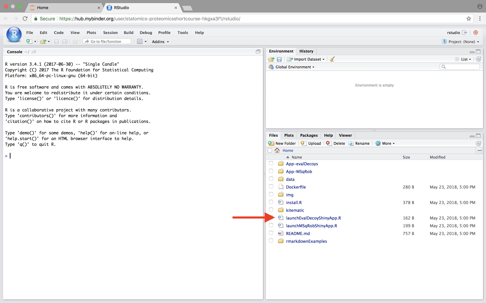
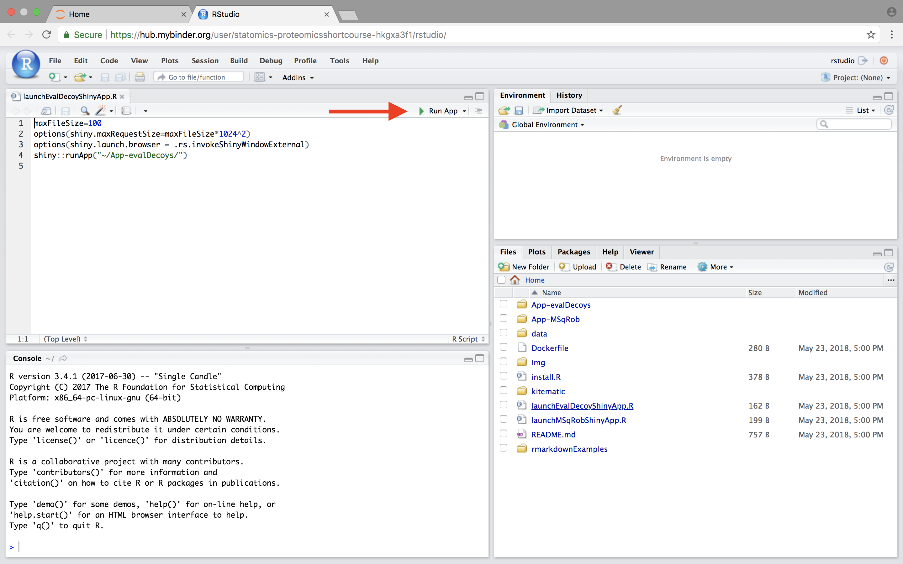
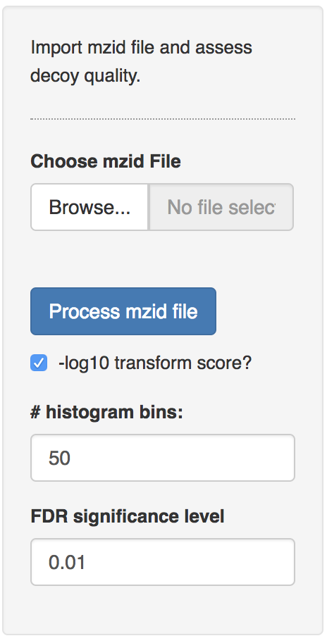
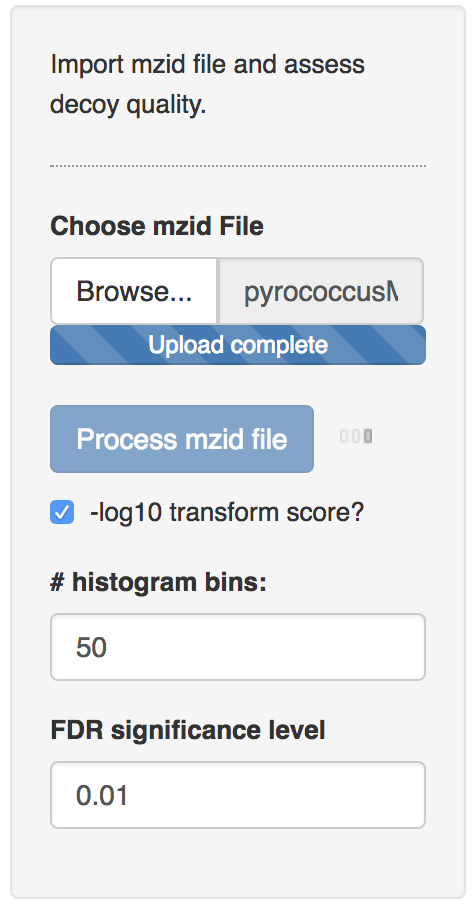
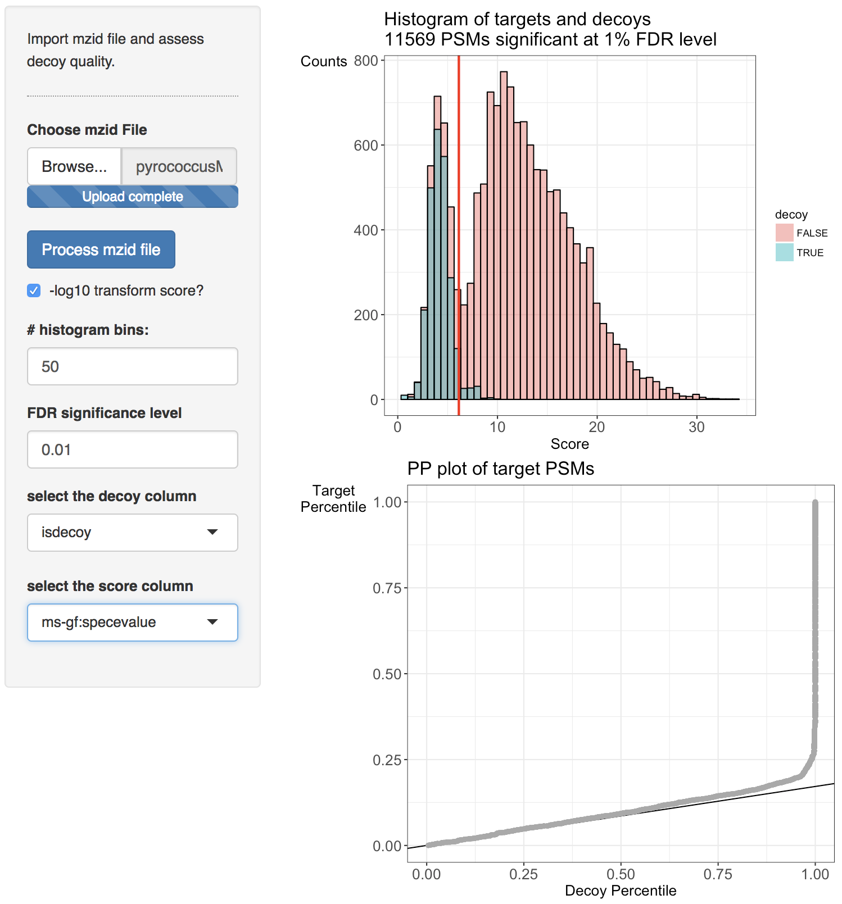

### 1. Identification: Evaluation of Target Decoy Approach

Shotgun proteomics relies on the assignment of a large number of spectra to theoretical peptides derived from a sequence database. Multiple search engines have been developed for this task, each with its own advantages and drawbacks. Most proteomics database searches are performed as so-called target/decoy searches. A crucial assumption of the target/decoy approach is that the decoy PSM hits have similar properties as bad target hits so that the decoys can be used to characterize the distribution of bad hits. In this tutorial we will introduce diagnostic plots that can be used to evaluate these assumptions.

#### 1.1 Basic Statistical Concepts

We first introduce some notation. With x we denote the PSM score and we assume that larger score values indicate a better match to the theoretical spectrum. Then the scores will follow a mixture distribution:

$$ f(x)=\pi_0 f_0 (x)+(1-\pi_0 ) f_1 (x), $$

with \\( f(x) \\) the target PSM score distribution, \\( f_0(x) \\) the mixture component corresponding to incorrect PSMs, \\( f_0(x) \\)  the mixture component corresponding to the correct PSMs and \\( \pi_0 \\) the fraction of incorrect PSMs.
Based on the mixture distribution we can calculate the posterior probability that a PSM with score x is a bad match:

$$ P[\text{Bad hit} \vert \text{score }x]=\frac{\pi_0 f_0 (x)}{f(x)}, $$

which is also referred to as the posterior error probability (PEP) in mass spectrometry based proteomics.
Based on the mixture model, we can also calculate the posterior probability that a random PSM in the set of all PSMs with scores above a score threshold t is a bad hit (see e.g. Figure 1):

$$ P[\text{Bad hit} \vert \text{score }x>t]=\pi_0 \frac{\int\limits_{x=t}^{+\infty} f_0(x)dx}{\int\limits_{x=t}^{+\infty} f(x)dx}, $$

with \\(\int\limits_{x=t}^{+\infty} f_0(x)dx \\) the probability to observe a bad PSM hit above the threshold and,  \\(\int\limits_{x=t}^{+\infty} f_0(x)dx \\)  the probability to observe a target PSM hit above the threshold. The probability \\( P[\text{Bad hit} \vert \text{score }x>t] \\) is also referred to as the false discovery rate (FDR) of the set of PSMs with scores above the threshold t. Hence, the FDR has the interpretation of the expected fraction of bad hits in the set of all target hits that are returned in the final PSM list.

 We would like to calculate the FDR corresponding to the set op PSMs with a target score above the threshold t.
In order to calculate the FDR, we thus have to characterize the distribution of the bad hits and of all PSMs.
In proteomics this is done by the use of the target/decoy approach.

#### 1.2. Target Decoy Approach

When using a competitive target decoy search, the FDR of the set of returned PSMs is estimated by dividing the number of accepted decoys PSMs by the number of accepted target PSMs above a certain score cutoff [1].

$$ \widehat{\text{FDR}}(t)=\frac{\# decoys | x>t}{\#targets |x>t} $$

This can be rewritten as:

$$ \widehat{\text{FDR}}(t)=\frac{\#decoys}{\#targets}\frac{\frac{\# decoys | x>t}{\#decoys}}{\frac{\#targets |x>t}{\#targets}} $$

$$ \widehat{\text{FDR}}(x) =
{\hat{\pi}_0}\frac{\widehat{\int\limits_t^{+\infty} f_0(x) dx}}{\widehat{\int\limits_t^{+\infty} f(x)dx}} $$

Hence, the proportion of bad hits \\( \pi_0 \\) is estimated as the number of decoys divided by the number of targets, and the competitive TDA assumes that it is equally likely that a bad hit matches to a bad target or to a decoy; the probability of  a (bad) target PSM hit above the threshold is estimated based on the empirical cumulative distribution in the sample, i.e. as the fraction of targets (decoys) that are above the threshold. Hence, a second assumption is that the decoy matches provide a good simulation of the target matches. See e.g. [2]. These assumptions can be evaluated with our EvalDecoyShiny App.

Figure 2. Illustration of the target and decoy distributions, in grey the histogram of the target PSM scores, the blue bars are the histogram of the decoy PSM scores. We indeed see that the decoy PSMs match well with  the incorrect targets that are more likely to occur at low scores. The red bars are an estimate of the correct target distribution and are equal to the target counts (gray histogram) minus the decoy counts (blue bars).

#### 1.3 Starting the App to evaluate TDA

When working with the online binder version, hit the binder button below:

Upon hitting the binder button an interactive statistical programming environment will open that is running on a cloud server. In this tutorial we will not make use of the powerful R-scripting environment, but we will launch an App with a GUI instead. Open the launchEvalDecoyShinyApp.R file by clicking on the file in the bottom right panel.

If you use the software on a more regular basis installing it in a local environment is advised, (see [software page](./software4stats.md)).
  - Open the RStudio app
  - Open the launchEvalDecoyShinyApp.R file in the folder where you unzipped the SGA2019 master

A novel panel opens in the topleft. Click on runApp to launch the EvalDecoy app.

The App is launched.

#### 1.4 Pyrococcus dataset

The Pyrococcus furiosus (strain ATCC 43587 / DSM 3638 / JCM 8422 / Vc1) reference proteome. The resulting database has 2,051 proteins in total (https://www.uniprot.org/uniprot/?query=taxonomy:186497, taxonomy:"Pyrococcus furiosus (strain ATCC 43587 / DSM 3638 / JCM 8422 / Vc1) [186497]").

The data can be found on [https://github.com/statOmics/SGA2019/tree/data](https://github.com/statOmics/SGA2019/tree/data).
Use the mzid file for the pyrococcus example, which can be found at data/identification/pyrococcusMSGF+.mzid
When the file is uploaded, push the "Process mzid file" button. It will take a while to process the file and you will see that the "Process mzid file" becomes light blue and that an activity indicator appears next to the button.

After processing the mzid file, two additional input tabs appear: one to select the decoy column, which is generally called "isdecoy" and another one to select the search engine score. Note, that two error messages appear because no diagnostic plots can be generated when the selected decoy column is not a variable of the type Boolean (TRUE or FALSE) and the engine score is not a numeric variable.

Select the column "isdecoy" for the "select the decoy column" tab and the "ms-gf:specevalue" column in the "select the score column" tab. Note, that e-values are always positive and that lower e-values are better. We therefore transform the e-values using a - log10 transformation so that larger values indicate better scores and also to enable a better discrimination of the good target scores, which are otherwise all compressed at low e-values.

Two diagnostic plots are generated. A histogram of target and decoy scores (top panels) and Probability-Probability plots (PP-plots). In the histogram the shape of the decoys (green) should be equal to that of bad target hits (first mode in the target distribution indicated in red). The height of the decoys can be slightly lower than the first mode in the target distribution because some good target hits also have a low score. Here, the histogram does not indicate problems with the TDA. The vertical red line displays the score threshold at the chosen FDR significance level, which by default is set at 0.01. Target PSMs above the threshold are considered to be reliable. 11750 PSMs can be returned at the 1% FDR level. Note, that few decoy PSMs occur above the threshold. Indeed at the 1% FDR level we expect that 1% of the PSMs in the returned PSM list correspond to a bad match so when the decoys are a good simulation of bad hits, some decoys can be expected above the threshold.

The number of bins in the histograms can be altered as well as the FDR significance level. Set the number of breaks at 100 and the FDR significance level at 0.05. What do you observe? [2.3a]

Deviations from the assumptions of TDA can be better evaluated in the PP-plot (lower panel). The PP-plot displays the empirical cumulative distribution (ECDF) from the target distribution in function that of the decoy distribution. PP-plots have the property that they show a straight 45 degree line through the origin if and only if both distributions are equivalent. Any deviation from this straight line indicates that the distributions differ. For targets and decoys this is obviously the case. The target distribution is stochastically larger than the decoy distribution as larger scores indicate more reliable hits and as decoys are believed to behave similarly to bad target hits. Hence, the PP-plot for targets vs decoys will always lay below the 45 degree line. When the decoys are a good simulation for the bad target hits, however, the lower values in the PP-plot should lay on a straight line that is located around \\( \hat{\pi}_0 \\). Indeed, at small target PSM scores are most likely bad hits.  The slope of the black line in the p-plot is based on the estimate of \\( \hat{\pi}_0 \\). The first part of the PP-plot for the pyrococcus example is linear with a slope that equals \\( \hat{\pi}_0 \\). This indicates that the decoy distribution and the mixture component for incorrect PSMs of the target mixture distribution coincide. The second part of the plot deviates from the line towards higher percentiles because the upper tail of the mixture component for incorrect subset PSMs and the lower tail of the mixture component for correct subset PSMs overlap and therefore target PSMs occur at a higher probability at intermediate scores than in the decoy distribution. Finally, the PP-plot becomes vertical, because all the decoys have been observed (decoy percentile=1) before all the scores of the target PSMs are observed. If we see this profile in the PP-plot, we have a good indication that the set of decoys from the complete search is representative for the mixture component for incorrect PSMs of the target mixture distribution. Hence, the assumptions of the concatenated TDA approach are not violated for the Pyrococcus example.

When the assumptions of the concatenated TDA approach are violated, the dots in the PP-plot at lower percentiles will deviate from the \\( \hat{\pi}_0 \\) line. In case the PP-plot is still a straight line at lower percentiles, then the shape of the decoy distribution is correct, but there are less (or more) decoys than expected under the concatenated TDA assumption, which could occur if the decoy database is different in size than the target database or when a bad hit is less likely to match to a decoy than to a target. This would also be visible in the histograms: the decoy histogram would be considerably lower (higher) than the first mode of the target distribution.
When the PP-plot at lower percentiles deviates from a straight line, the distribution of decoys and the bad target PSMs is not equivalent, indicating that the decoys are not a good simulation of bad target hits.
Both type of deviations should be of concern as they indicate that the FDR returned by the conventional concatenated TDA is incorrect.

##### 1. Assess the search you performed in "Tutorial 1. Peptide and Protein Identification" at https://compomics.com/bioinformatics-for-proteomics/identification/
Open the search from tutorial 1.3. in Peptide Shaker and export the search to an mzid file by clicking export > Peptide Shaker Project As > mzIdentML. Evaluate the TDA for the ommsa, X!Tandem and the Peptide Shaker score.

Evaluate the TDA for the  X!Tandem, OMSSA and Peptide Shaker scores. What do you observe and try to explain. [1.4.a]

##### 2. Pyrococcus - Peptide Shaker - Uniprot search

Users familiar with R are advised to download the notebook [assessDecoys.Rmd](https://raw.githubusercontent.com/statOmics/SGA2019/gh-pages/assets/assessDecoys.Rmd)  and to alter it for the analysis in th.

Do the analysis for the search MSGF+, X!Tandem, OMSSA and Peptide Shaker scores based on all Pyrococcus proteins in a search against all pyrococcus peptides in Uniprot (data/identification/pyroUniprot.mzid).

What do you observe explain. [1.4.b]

##### 3. Pyrococcus/Peptide Shaker - Swiss prot search
Do the analysis for the search MSGF+, X!Tandem, OMSSA and Peptide Shaker scores for Pyrococcus based on the curated proteins from swissprot only (data/identification/pyroSwissprot.mzid). What do you observe. Try to explain. [1.4.c]

##### 4. FDR Elias and Gygi, 2007
Elias and Gygi, 2007, reported the following target decoy FDR estimation:

$$\widehat{\text{FDR}}(t)=\frac {2 \times (\#decoys >t)}{\#decoys > t + \#targets > t}$$

Do you agree with this expression? Why, why not? [1.4.d]

#### References

[1] Elias JE, Gygi SP. Target-decoy search strategy for increased confidence in large-scale protein identifications by mass spectrometry. Nat Methods. 2007; 4:207--214.

[2] Sticker, A., Martens, L. and Clement, L. (2017). Mass spectrometrists should search for all peptides, but assess only the ones they care about. Nature Methods 14, 643--644.
