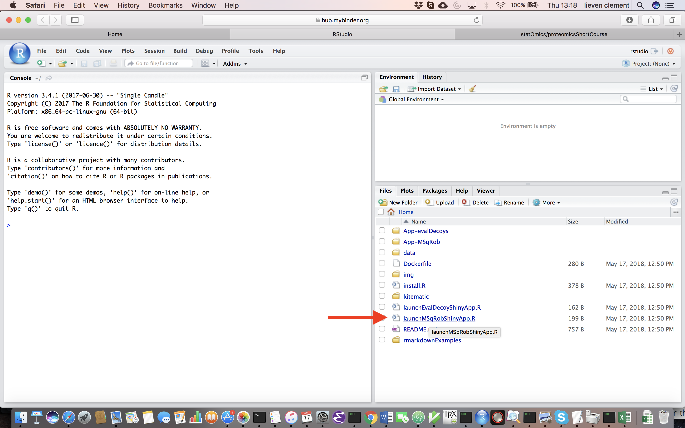
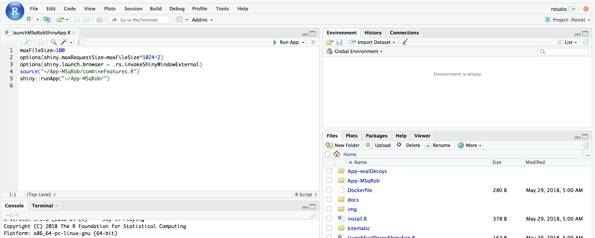
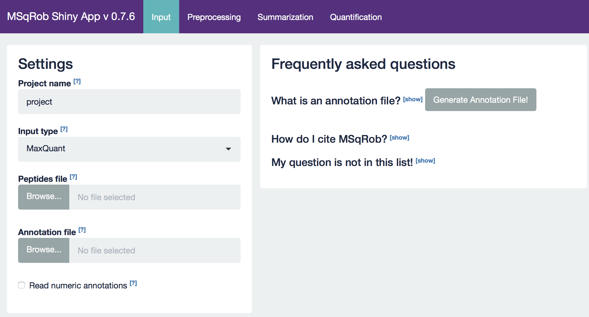

### 3. Analysis of more complex designs with MSqRob
The result of a quantitative analysis is a list of peptide and/or protein abundances for every protein in different samples, or abundance ratios between the samples. In this chapter we will extend our generic workflow for differential analysis of quantitative datasets with more complex experimental designs.
In order to extract relevant information from these massive datasets, we will use the MSqRob Shiny GUI, a graphical interface that allows for straightforward data inspection and robust relative protein quantification [1]. The material in this tutorial is partially based on our paper Experimental design and data-analysis in label-free quantitative LC/MS proteomics: A tutorial with MSqRob [2].

#### 3.1 Basic Statistical Concepts
The actual design of an experiment strongly impacts the data analysis and its power to discover differentially abundant proteins. Therefore, we first cover some basic concepts on experimental design. Next, we provide a general step-by-step overview of a typical quantitative proteomics data analysis workflow. The monthly column “Points of significance” in Nature Methods is a useful primer on statistical design for researchers in life sciences to which we extensively refer in this section (http://www.nature.com/collections/qghhqm/pointsofsignificance).
For proteomics experiments it is important to differentiate between experimental units and observational units. Experimental units are the subjects/objects on which one applies a given treatment, often also denoted as biological repeats. In a proteomics experiment, the number of experimental units is typically rather limited (e.g. three biological repeats of a knockout and three for a wild-type sample). The measurements, however, are gathered on the observational units. In a shotgun proteomics experiment, these are the individual peptide intensities. For many proteins, there are thus multiple observations/peptide intensities for each experimental unit, which can be considered as technical replicates or pseudo-replicates [3].  Hence, one can make very precise estimates on the technical variability of the intensity measurements; i.e. how strongly intensity measurements fluctuate for a particular protein in a particular sample. However, the power to generalize the effects observed in the sample to the whole population remains limited as most biological experiments typically only have a limited number of biological repeats [4]. We thus strongly advise researchers to think upfront about their experimental design and to maximize the number of biological repeats (we suggest at least three biological repeats, and preferably more).

A very powerful concept in experimental design is that of blocking [5]. In randomized complete block design one randomizes the different treatments to experimental units that are arranged within groups/blocks (e.g. batches, time periods) that are similar to each other. Due to practical constraints, it is often impossible to perform all experiments on the same day, or even on the same HPLC column or mass spectrometer, leading to unwanted sources of technical variation. In other experiments, researchers might test the treatment in multiple cultures or in big experiments that involve multiple labs. A good experimental design aims to mitigate unwanted sources of variability by including all or as many treatments as possible within each block. That way, variability between blocks can be factored out from the analysis when assessing treatment effects (Figure 1). It is of prime importance that all treatments are present within each block, otherwise confounding can occur between the treatment and block e.g. (Figure 1).

Figure 1. Example of a good (A) and a bad (B) design. In design A, both the green and orange treatments are divided equally within each block. That way, the treatment effect can be estimated within a block. In design B, each block contains only one treatment, so the treatment effect is entirely confounded with the blocking effect and it is thus impossible to draw meaningful conclusions on the treatment (unless one would be willing to assume that the blocking effect is negligible, which is a very strong assumption that cannot be verified based on the design).

#### 3.2 Using MSqRob

Users familiar with R are advised to download the notebook [cptacAvsB_lab3.Rmd](https://raw.githubusercontent.com/statOmics/SGA2019/gh-pages/assets/rmarkdownExamples/cptacAvsB_lab3.Rmd)  and to alter it for the analysis of both examples below.

Users who are not familiar with R can use the MSqRob GUI. For installation instruction see [Install and Launch Statistical Software](./software4stats.md)

When working with the online binder version, hit the binder button below:

If you use the software on a more regular basis installing it in a local environment is advised, (see [software page](./software4stats.md)).

Upon hitting the binder button an interactive statistical programming environment will open that is running on a cloud server. Open the launchMSqRobShinyApp.R file by clicking on the file in the bottom right panel.

A novel panel opens in the topleft. Click on runApp to launch the MSqROb app.

The MSqRob App is launched:

*Hint: Click on the question marks to get extra information about an input field.*

  

#### 3.3 Blocking: Mouse T-cell example

Duguet et al. 2017 compared the proteomes of mouse regulatory T cells (Treg) and conventional T cells (Tconv) in order to discover differentially regulated proteins between these two cell populations. For each biological repeat the proteomes were extracted for both Treg and Tconv cell pools, which were purified by flow cytometry. The data in data/quantification/mouseTcell on the SGA2019Data repository are a subset of the data [PXD004436](https://www.ebi.ac.uk/pride/archive/projects/PXD004436) on PRIDE.

Three subsets of the data are avialable:

- peptidesCRD.txt: contains data of Tconv cells for 4 bio-repeats and Treg cells for 4 bio-repeats
- peptidesRCB.txt: contains data for 4 bio-repeats only, but for each bio-repeat the Treg and Tconv proteome is profiled.   
- peptides.txt: contains data of Treg and Tconv cells for 7 bio-repeats

Users familiar with R are advised to download the notebook [cptacAvsB_lab3.Rmd](https://raw.githubusercontent.com/statOmics/SGA2019/gh-pages/assets/rmarkdownExamples/cptacAvsB_lab3.Rmd)  and to alter it for the analysis of the Mouse T-cell example.
Users who are not familiar with R can do the analysis with the GUI.

##### 3.3.1. How would you analyse the CRD data?

##### 3.3.2. How would you analyse the RCB data?

##### 3.3.3. Try to explain the difference in the number of proteins that can be discovered with both designs?

  

#### 3.4 Heart dataset

Researchers have assessed the proteome in different regions of the heart for 3 patients (identifiers 3, 4, and 8). For each patient they sampled the left atrium (LA), right atrium (RA), left ventricle (LV) and the right ventricle (RV). The data are a small subset of the public dataset  [PXD006675](https://www.ebi.ac.uk/pride/archive/projects/PXD006675) on PRIDE.

Suppose that researchers are mainly interested in comparing the ventricular to the atrial proteome.
Particularly, they would like to compare the left atrium to the left ventricle, the right atrium to the right ventricle, the average ventricular vs atrial proteome and if ventricular vs atrial proteome shifts differ between left and right heart region.

Users familiar with R are advised to download the notebook [cptacAvsB_lab3.Rmd](https://raw.githubusercontent.com/statOmics/SGA2019/gh-pages/assets/rmarkdownExamples/cptacAvsB_lab3.Rmd)  and to alter it for the analysis of the heart example.
Users who are not familiar with R can do the analysis with the GUI.

##### 3.4.1. Which factors will you use in the mean model?

##### 3.4.2. Spell out the contrast for each research question?

##### 3.4.3. Interpret the estimate for the top hit of each contrast?

##### 3.4.4. Try to explain why there is such a large difference in the number of significant proteins that are found between the contrasts?
