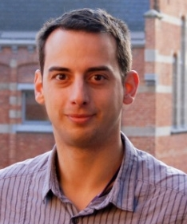
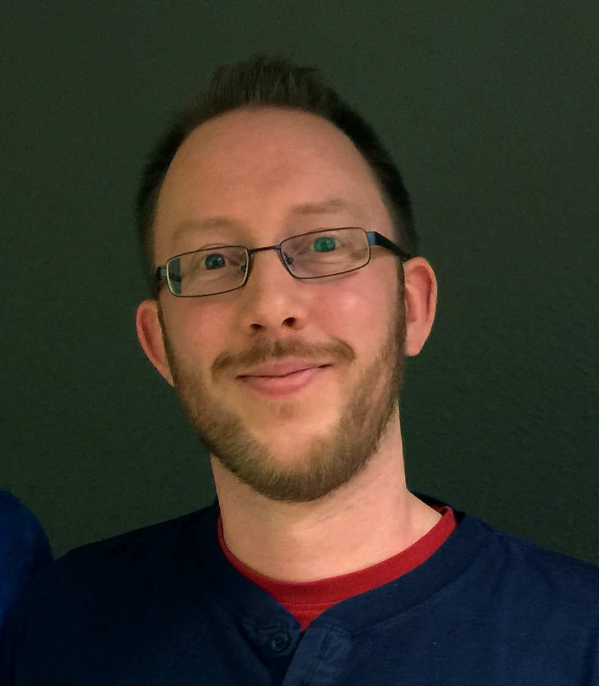

## Mass Spectrometry (MS) & Bioinformatics for Proteomics

### Introduction to Proteomics and MS technology

- [Lecture mass spectrometry basics - Part 1 - Amino Acids and Proteins (30:46)](https://www.youtube.com/watch?v=bS78rIYvFBE)
- [Lecture mass spectrometry basics - Part 2 - Mass Spectrometry: Concepts and Components. Ion Sources (39:30)](https://www.youtube.com/watch?v=vXsotPtOdRY)
- [Lecture mass spectrometry basics - Part 3 - Mass Spectrometry: Analysers (34:10)](https://www.youtube.com/watch?v=NKXhyjsgT1I)
- [Lecture mass spectrometry basics - Part 4 - Mass Spectrometry: Detectors (19:01)](https://www.youtube.com/watch?v=lxtPIyFnzGk)
- [Lecture mass spectrometry basics - Part 5 - Mass Spectrometry: FCT-IR and Orbitrap (12:55)](https://www.youtube.com/watch?v=rLmpfFjNJd4)
- [Lecture mass spectrometry basics - Part 6 - Tandem Mass Spectrometry (24:54)](https://www.youtube.com/watch?v=Wy1SwrMzhYk)
- [Lecture mass spectrometry basics - Part 7 - A CID Fragmentation Primer (25:37)](https://www.youtube.com/watch?v=JBt_9hBnXcQ)

### Bioinformatics for proteomics

- Slides: [Bioinformatics for Proteomics](assets/martens_proteomics_bioinformatics_20180529.pdf)
- Slides: [Quantification in MS proteomics](assets/martens_proteomics_quantification_20180530.pdf)
- Slides: [Data Sharing](DataSharingPDA18.pdf)
- Tutorials: [Tutorials Bioinformatics for Proteomics](https://compomics.com/bioinformatics-for-proteomics/)  

---
### Material by Lennart Martens and Harald Barsnes

**Lennart Martens** Lennart Martens is Full Professor of Systems Biology at Ghent University, group leader of the Computational Omics and Systems Biology (CompOmics) group at VIB, and Associate Director of the VIB-UGent Center for Medical Biotechnology, all in Ghent, Belgium. He has been working in proteomics bioinformatics since his Master’s degree, which focused on the computational interpretation of peptide mass spectra. He then worked as a software developer and framework architect for a software company for a few years, before returning to Ghent University to pursue a Ph.D. focused on proteomics and proteomics informatics. During this time, he worked on the development of high-throughput peptide centric proteomics techniques and on bioinformatics tools to support these new approaches. In 2003 he started the PRIDE proteomics database at the EBI as a Marie Curie fellow of the European Commission. After obtaining his Ph.D., he rejoined the PRIDE group at EBI, which he coordinated for several years before moving back to Ghent University to take up his current position. Prof. Martens has been elected to the Human Proteome Organisation (HUPO) Council in 2016, and to the HUPO Executive Board in 2017. He received the 2014 Prometheus Award for Research Excellence from Ghent University, and the 2015 ‘Juan Pablo Albar’ Proteomics Pioneer Award from the European Proteomics Association. An author on more than 200 peer-reviewed papers, he has also co- written two popular Wiley textbooks: Computational Methods for Mass Spectrometry Proteomics (ISBN: 978-0-470-51297-5), and Computational and Statistical Methods for Protein Quantification by Mass Spectrometry (ISBN: 978-1-119-96400-1).

**Affiliation**: Ghent University and VIB, Ghent, BE

---
### Harald Barsnes

**Harald Barsnes** is a group leader at both the Computational Biology Unit at the Department of Informatics and at the Proteomics Unit at the Department of Biomedicine, both at the University of Bergen, Norway. The main focus of his group is the development of user-friendly open-source bioinformatics tools that enable and empower researchers to analyse and share their own data. His research has resulted in numerous publications and a long list of freely available proteomics software, e.g., PeptideShaker, SearchGUI and PRIDE Converter. Barsnes has also been a guest editor in PROTEOMICS and has co-authored a Wiley text book called 'Computational and Statistical Methods for Protein Quantification by Mass Spectrometry'. In 2015 he received the Meltzer Award for Excellent Young Researchers at the University of Bergen, and in 2016 he was awarded a prestigious recruitment fellowship from the Bergen Research Foundation.

**Affiliation**: Department of Biomedicine and Department of Informatics, University of Bergen, NO

